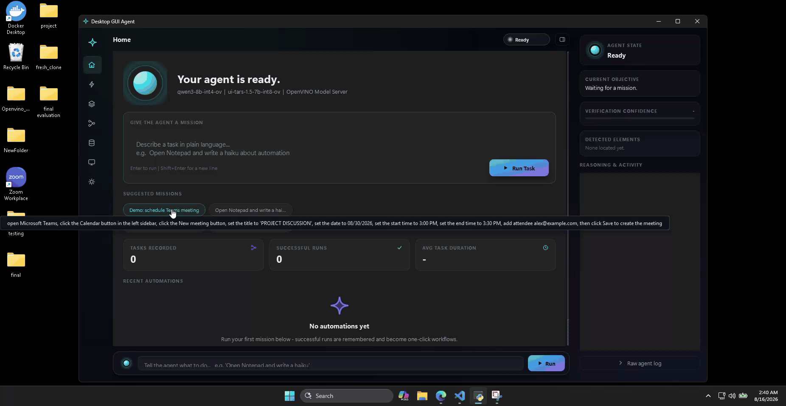
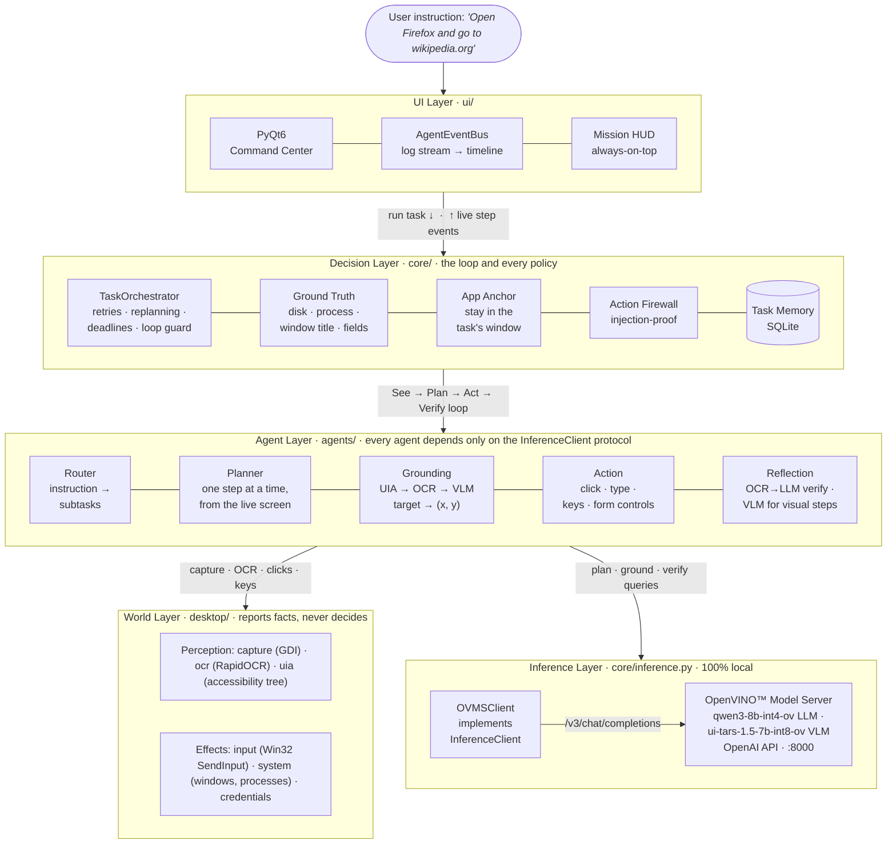

<div align="center">

<a href="https://github.com/openvinotoolkit/openvino"></a>

# Desktop GUI Agent

**Tell your computer what to do, in plain English.**
An autonomous desktop agent that observes your screen, plans, clicks, types, and
**verifies every single step**. It runs entirely on your own machine via
OpenVINO™ Model Server. No cloud. No API keys. No data ever leaves your desk.

[](https://www.python.org/downloads/)
[](#installation)
[](LICENSE)
[](https://github.com/openvinotoolkit/model_server)
[](https://www.riverbankcomputing.com/software/pyqt/)
[](#running-tests)

[How It Works](#how-it-works) •
[Architecture](#architecture) •
[Installation](#installation) •
[Safety](#safety) •
[Env Vars](#environment-variables) •
[Contributing](CONTRIBUTING.md)



</div>

---

## How It Works

The agent runs a closed-loop **See → Plan → Act → Verify** cycle at every step:

```
User Instruction
      │
      ▼
┌─────────────┐   decompose    ┌──────────────────────┐
│ Router Agent│ ──────────────▶│  Sub-tasks (ordered) │
└─────────────┘                └──────────────────────┘
                                          │
                          ┌───────────────┘  for each sub-task
                          ▼
                ┌──────────────────┐
                │  Planning Agent  │  plans ONE step at a time
                └──────────────────┘  from the LIVE screen state
                          │
              ┌───────────┴────────────┐
              ▼                        ▼
    ┌──────────────────┐    ┌──────────────────┐
    │ Grounding Agent  │    │  Action Agent    │
    │  UIA / OCR / VLM │    │  clicks, types,  │
    │  → screen (x, y) │    │  presses keys    │
    └──────────────────┘    └──────────────────┘
                                     │
                                     ▼
                          ┌──────────────────────┐
                          │  Reflection Agent    │  OCR→LLM verifies outcome
                          └──────────────────────┘  (VLM check for visual steps)
                                     │
                          confirmed? ─▶ next step
                             failed? ─▶ retry / replan
```

Planning is **dynamic**: the planner sees the live screen before every step, so
it recovers from popups, focus changes, and failed actions instead of blindly
executing a stale plan.

### Grounding pipeline (fastest → most robust)

| Stage | Method | When it fires |
|-------|--------|---------------|
| 0 | Windows UIA accessibility tree | Exact coordinates in ~20-50 ms |
| 1 | OCR fuzzy-match (RapidOCR) | Target text is visible on screen |
| 2 | VLM direct (x, y) coordinates (UI-TARS) | Icon, field, or unlabelled element |

If all stages miss, the grounder asks the LLM for alternative label phrasings
and retries the pipeline.

---

## Architecture

The system is organised into five layers. Every agent depends only on the
`InferenceClient` protocol, never on a concrete backend, so the inference
engine is drop-in replaceable.

> **New to the code?** Start with [ARCHITECTURE.md](ARCHITECTURE.md): the
> current end-to-end pipeline, the table of ground-truth mechanisms, and a
> one-line map of every file. The [Code Tour](docs/CODE_TOUR.md) adds a
> guided reading order through the modules.



The orchestrator owns the loop. It consults memory before routing, screens
every typed command through the firewall, and arms the kill switch for the
duration of a task. Agents do one job each and touch the world only through
the desktop layer. All model calls funnel through a single client behind the
`InferenceClient` protocol (`core/inference.py`), which is what let the
inference backend move to OpenVINO™ Model Server without touching an agent.

Dependencies point one way (`ui → core → agents → desktop`), and the rule at
the bottom boundary is that **`desktop/` reports facts and never decides**:
`desktop.system.count_process_windows()` says how many windows an app owns,
while `core.groundtruth` decides whether that counts as a launch. That split
is why the whole policy layer is unit-tested on Linux with no GPU.

| Agent | Consumes | Produces |
|-------|----------|----------|
| Router | instruction, screen context, installed apps | ordered `SubTask` list |
| Planner | subtask, live OCR context, step history | next `ActionStep` (or *done*) |
| Grounding | target description, screen | `(x, y)` + confidence |
| Action | grounded step | real mouse / keyboard events |
| Reflection | post-action screen | verdict: success · fail · uncertain |

The orchestrator also handles failure modes that show up in real runs: a
**loop guard** stops a plan stuck repeating the same step, **idempotency
protection** never blind-retries non-repeatable actions like typing or Enter,
**visual replanning** escalates to the VLM when text-based planning stalls,
and a task that only finished through a recovery path is marked degraded, so
it is never recorded as a clean success.

### Long multi-step tasks

Big jobs (scheduling a meeting, multi-app file pipelines) get four extra
mechanisms:

- **Structured form control.** `set_value` / `select` / `invoke` actions
  manipulate text fields, dropdowns, date pickers, and buttons directly
  through the Windows UIA accessibility tree (ValuePattern /
  SelectionItemPattern / InvokePattern) and verify by reading the control
  state back. No pixel-guessing on forms; falls back to click+type when an
  app draws its own widgets.
- **Adaptive budgets.** The task deadline scales with plan size
  (`n_subtasks × subtask budget`, floored at 10 min), so an 8-subtask task
  gets the time it legitimately needs while a stuck 2-subtask task still
  dies quickly.
- **Task-level replanning.** When a subtask fails, the router is re-consulted
  with everything already completed and produces a fresh plan for the
  remaining work using a different approach, instead of throwing the whole
  task away (capped at 2 replans).
- **Clarifying questions.** Instructions like *"schedule a Zoom meeting"*
  that omit required details (time, invitees) trigger a dialog asking for
  them **before** execution starts, instead of guessing.

---

## Models

Model ids live in [`config.py`](config.py), the single source of truth.

| Role | Model (OVMS servable) | Source | Purpose |
|------|-----------------------|--------|---------|
| **LLM** | `qwen3-8b-int4-ov` | [`OpenVINO/Qwen3-8B-int4-ov`](https://huggingface.co/OpenVINO/Qwen3-8B-int4-ov) (pre-converted) | Routing, planning, reflection reasoning |
| **VLM** | `ui-tars-1.5-7b-int8-ov` | [`ByteDance-Seed/UI-TARS-1.5-7B`](https://huggingface.co/ByteDance-Seed/UI-TARS-1.5-7B) (converted to INT8 on first run) | GUI grounding, visual verification |

Both models are served by a **single OpenVINO™ Model Server instance** on one
OpenAI-compatible endpoint (`http://localhost:8000/v3/chat/completions`) and
selected per request by the `model` field. The default sizing targets a
**27 GB Intel® GPU**: 8B LLM weights (~5.5 GB) + 7B VLM weights at **INT8**
(~7.5 GB) + KV-caches (4 GB LLM / 2 GB VLM) stay resident, with no model
swapping and ~6 GB spare. The 8B reasoning model runs faster on the iGPU than the 14B and
frees the VRAM to ground with the more accurate INT8 UI-TARS. For stronger
reasoning, swap in `qwen3-14b-int4-ov` / `OpenVINO/Qwen3-14B-int4-ov`. It
still fits alongside the INT8 VLM (~24.7 GB). Adjust `LLM_WEIGHT_FORMAT`,
`VLM_WEIGHT_FORMAT`, `LLM_KV_CACHE_GB`, `VLM_KV_CACHE_GB`, and `TARGET_DEVICE`
(GPU / CPU / NPU / AUTO) in [`config.py`](config.py) for your hardware
(`start.py` re-exports and unregisters old servables automatically).

---

## Requirements

| | Minimum | Recommended |
|-|---------|-------------|
| OS | Windows 10 | Windows 11 |
| Python | 3.10 | 3.12 |
| RAM | 16 GB | 32 GB |
| GPU VRAM | 16 GB Intel Arc / iGPU (8B LLM + INT4 VLM, smaller KV-cache) | 27 GB (default config: 8B LLM + INT8 VLM) |
| Disk | 20 GB free | 30 GB free |

> **No Intel GPU?** It still runs. `start.py` detects that and uses the CPU
> instead: same setup, same commands, slower steps.

---

## Installation

You need **Python 3.10, 3.11 or 3.12**, **Git**, and the
[Visual C++ Redistributable (x64)](https://aka.ms/vs/17/release/vc_redist.x64.exe).

> **3.13 and newer do not work.** `rapidocr-onnxruntime`, the OCR engine behind
> grounding, publishes no wheel for them. Check with `python --version`, and
> `py -0` to list what you have. Build the venv with `py -3.12 -m venv venv` if
> your default `python` is newer. `start.py` stops with this message if not.

Then, in PowerShell:

```powershell
git clone https://github.com/Shehrozkashif/OpenVINO-Autonomous-GUI-Agent.git
cd OpenVINO-Autonomous-GUI-Agent
py -3.12 -m venv venv
venv\Scripts\activate
python start.py
```

That is the whole setup. `start.py` does the rest itself:

| It checks | And if it is missing |
|-----------|----------------------|
| Python packages (`requirements.txt`) | installs them |
| OpenVINO™ Model Server | downloads and unpacks `ovms.exe` into `.\ovms\` |
| Model-conversion toolchain (`requirements-export.txt`) | installs it, CPU-only torch first, and only when a model actually has to be built |
| The two models | pulls the LLM, converts UI-TARS, registers both with OVMS |
| An Intel GPU | falls back to the CPU, and re-points models exported elsewhere at this machine's device |

Nothing to unzip by hand, no `OVMS_DIR` to set. Every later run is the same
three lines (`cd`, `venv\Scripts\activate`, `python start.py`), and skips
whatever is already done.

**The first run takes 30-60 minutes** and downloads ~15 GB, because UI-TARS is
converted and quantized on your machine. This happens once.

A few things worth knowing:

- **Use the venv.** Activate it before running `start.py`, or the packages land
  system-wide. `start.py` warns you if you forgot.
- **Already have OVMS?** Set `OVMS_DIR` to the folder holding `ovms.exe` and
  `start.py` uses that instead of downloading its own.
- **Deploying to a machine that already has converted models in `models/`?**
  Only `requirements.txt` is ever installed there: the agent talks to OVMS
  over HTTP and imports no ML framework.

> **Do NOT run `setupvars.bat` in your agent terminal.** It sets
> `PYTHONHOME`/`PYTHONPATH` to OVMS's bundled Python, which hijacks your venv
> (`ModuleNotFoundError: No module named 'config'`). `start.py` sources it
> **inside the `ovms.exe` subprocess only**. Just run `python start.py` from
> a clean shell.

```powershell
# Pre-fill the instruction box
python start.py --prompt "Open VS Code and enable autosave"

# Pre-fill and run immediately on startup
python start.py --prompt "Search for OpenVINO documentation" --auto-run
```

### Using the GUI

1. **Type** your instruction in the command dock (e.g. `"Open Firefox and go to wikipedia.org"`)
2. **Run.** The window minimises, an always-on-top mission HUD appears, and the agent takes over
3. **Watch** Mission Control: a live timeline of every subtask, step, grounding hit, and verification verdict
4. **Stop** any time, from the HUD, the GUI, or the keyboard kill switch

Other pages: **Agent Sessions** (task history & re-run), **Workflows**,
**Task History** (tasks that completed cleanly), **Screen History** (frames
recorded during missions), and **Settings**.

<details>
<summary><b>Manual setup, without start.py</b></summary>

Everything `start.py` automates, done by hand. Useful for debugging one stage
in isolation.

```powershell
# Packages: runtime, then the one-time conversion toolchain (CPU torch first)
pip install -r requirements.txt
pip install torch --index-url https://download.pytorch.org/whl/cpu
pip install -r requirements-export.txt

# OpenVINO Model Server: a native binary, not a pip package.
# PowerShell aliases `curl` to Invoke-WebRequest, so call curl.exe / tar.exe:
curl.exe -L https://github.com/openvinotoolkit/model_server/releases/download/v2026.2/ovms_windows_2026.2.0_python_on.zip -o ovms.zip
tar.exe -xf ovms.zip          # extracts .\ovms\ containing ovms.exe + setupvars.bat

# Intel's converter, which start.py otherwise fetches into tools/ovms/ on first run:
curl.exe -L https://raw.githubusercontent.com/openvinotoolkit/model_server/releases/2025/3/demos/common/export_models/export_model.py -o tools\ovms\export_model.py

# 1. Pull / convert both models into the OVMS repository (writes models/config.json)
#    --enable_prefix_caching: reuse the KV cache of a prompt prefix already seen.
#      Every planning call re-sends the same ~5.8k-token system prompt, so without
#      this the GPU re-reads it from scratch on every step.
#    --prompt_lookup_decoding: the planner's answer is largely strings copied out
#      of its own prompt (control names, dates), so let the server guess those runs
#      instead of writing them a token at a time. Text model only — the VLM answers
#      with a coordinate pair, too short for guessing ahead to pay off.
#    Both are lossless. Omitting them roughly doubles the time per task.
python tools/ovms/export_model.py text_generation `
  --source_model OpenVINO/Qwen3-8B-int4-ov  --model_name qwen3-8b-int4-ov `
  --weight-format int4 --config_file_path models/config.json `
  --model_repository_path models --target_device GPU --cache_size 4 `
  --enable_prefix_caching --prompt_lookup_decoding

python tools/ovms/export_model.py text_generation `
  --source_model ByteDance-Seed/UI-TARS-1.5-7B --model_name ui-tars-1.5-7b-int8-ov `
  --weight-format int8 --config_file_path models/config.json `
  --model_repository_path models --target_device GPU --cache_size 2 `
  --enable_prefix_caching

# 2. Serve both from one OVMS instance. The device is baked into each servable
#    at export time (step 1's --target_device), so do NOT pass --target_device
#    alongside --config_path. setupvars must run in the ovms.exe process only:
.\ovms\setupvars.bat && .\ovms\ovms.exe --config_path models\config.json --rest_port 8000

# 3. Launch the agent against the running server
python main.py
```

```powershell
# Checking the server
curl http://localhost:8000/v1/config        # servable states (AVAILABLE?)
```

</details>

---

## Project Structure

```
OpenVINO-Autonomous-GUI-Agent/
├── start.py                  ← single entry point (run this): installs deps,
│                               fetches OVMS, prepares models, starts everything
├── main.py                   ← Qt app + orchestrator wiring
├── config.py                 ← model ids & server settings (single source of truth)
│
├── core/                      # the loop and its policy: decides what to do
│   ├── orchestrator.py        # See → Plan → Act → Verify loop, recovery policy
│   ├── runstate.py            # every budget and limit; per-subtask run state
│   ├── groundtruth.py         # checks the OS can prove (disk, process, title, fields)
│   ├── subtasks.py            # what a subtask's own words ask for
│   ├── apps.py                # app name → executable / on-screen signals
│   ├── anchor.py              # which window the task owns; clicks stay inside it
│   ├── firewall.py            # deterministic destructive-command classifier
│   ├── inference.py           # InferenceClient protocol + OVMS client
│   ├── history.py             # SQLite record of completed tasks (for the UI)
│   └── types.py               # SubTask, ActionStep
│
├── agents/                    # one model-facing job each
│   ├── router.py              # instruction → subtasks; replanning; clarifying questions
│   ├── planning.py            # subtask + screen → next ActionStep(s)
│   ├── grounding.py           # target text → (x, y): UIA → OCR → VLM
│   ├── coords.py              # VLM answer → screen pixel
│   ├── action.py              # executes one step
│   ├── reflection.py          # OCR→LLM / VLM verification
│   └── prompts.py             # every system prompt, in one file
│
├── desktop/                   # Windows facts and effects: reports, never decides
│   ├── uia.py                 # accessibility tree: search + structured actions
│   ├── input.py               # Win32 SendInput mouse/keyboard + kill switch
│   ├── capture.py             # GDI capture, frame hashing, own-window mask
│   ├── ocr.py                 # RapidOCR engine + fuzzy label matching
│   ├── snapshot.py            # foreground-aware OCR snapshot
│   ├── system.py              # DPI, windows, processes, installed apps, GPUs
│   ├── clipboard.py           # clipboard paste-typing
│   └── credentials.py         # OS-keyring credential storage
│
├── ui/                        # PyQt6 command-center GUI
├── tests/
│   ├── unit/                  # 568 tests: fast, no backend or desktop required
│   └── live/                  # real-desktop suites (require OVMS + display)
├── requirements.txt           # runtime deps (no ML framework, HTTP to OVMS)
├── requirements-export.txt    # one-time model-conversion toolchain
├── requirements-dev.txt       # pytest + ruff
├── ARCHITECTURE.md            # pipeline, ground-truth table, file map
└── docs/CODE_TOUR.md          # guided reading order through the modules

  created on first run, not in git:
    ovms/                      # the downloaded OpenVINO Model Server
    models/                    # exported servables + OVMS config.json
    tools/ovms/export_model.py # Intel's converter, fetched once
```

---

## Safety

- **Action firewall.** Every `type` step is screened by a deterministic
  classifier before execution; destructive shell commands (`rm -rf /`, `mkfs`,
  fork bombs, …) are blocked. It never calls a model, so it is immune to
  prompt injection.
- **Kill switch.** Press Esc three times, or slam the mouse into the
  top-left corner, to stop the agent instantly and release all held keys.
- **Wall-clock budgets.** A stuck task aborts instead of running unbounded
  (4 min/subtask; the task budget scales with plan size, min 10 min).
- **Human confirmation.** Destructive commands pop a yes/no dialog when the
  GUI is attached; unattended, HIGH-severity commands are blocked outright.
- **Credential safety.** `{{cred:site:field}}` values live in the OS keyring,
  are redacted from all logs, and are cleared from the clipboard after paste.
- **Keyboard injection** uses raw `win32 SendInput` via `ctypes`: standard
  OS-level events, same as a real keyboard.
- **Agent window minimises** before executing tasks so the agent never clicks
  its own UI.
- **Max retries.** Each step retries at most 3 times before the task is
  marked failed.

---

## Environment Variables

All optional. Every one is read fresh on each run, so setting it in the shell
before `python start.py` is enough.

| Variable | Effect |
|---|---|
| `AGENT_DISABLE_UIA=1` | Turns off **every** Windows UIA path: Stage 0 grounding, the planner's clickable-controls list, `set_value` / `select` / `invoke`, and occlusion hit-testing. Grounding falls to OCR then the VLM. **This also removes most of the verification in [Safety](#safety)** — control read-back, controls-diff and focused-control read-back all come from the same tree, so runs get markedly less reliable. Intended for exercising the OCR/VLM path, not for normal use. |
| `AGENT_DISABLE_OCR=1` | Turns off OCR grounding (Stage 1) only, so grounding falls to the VLM. OCR still runs for planner screen context and reflection. Set together with `AGENT_DISABLE_UIA=1` to force every grounding call through UI-TARS. |
| `AGENT_FORCE_MOUSE=1` / `0` | Overrides `FORCE_MOUSE` in `config.py` (default on). On, every grounded click is delivered by the real cursor; off prefers the UIA pattern-invoke, which is more robust on WebView2 buttons that swallow synthesized clicks. |
| `AGENT_GLIDE_MAX_S=1.5` | Longest a single cursor move may take, in seconds (default `0.30`, clamped to `10`). Raise it to actually watch the pointer travel during a demo. Cosmetic only: screenshots never capture the cursor. |
| `AGENT_LOG_DIR=<path>` | Where run logs are written. |
| `AGENT_LOG_LEVEL=DEBUG` | Console log level. `DEBUG` adds per-call model timings and OCR region counts. |
| `AGENT_LOG_RETENTION=<n>` | How many past run logs to keep. |

> **A note on `AGENT_DISABLE_UIA`.** The accessibility tree is where this agent
> gets its ground truth. With it off, a verdict rests on OCR text plus the
> model's reading of it, which is exactly the "confidently wrong" failure the
> tree exists to prevent. Expect worse results, and do not judge the agent by a
> run made with this set.

---

## Running Tests

```powershell
venv\Scripts\activate

# Unit tests: 568 without PyQt6, 603 with it (the GUI suite). Fast, no backend
# or desktop required.
pytest

# Lint
ruff check .

# Long-horizon live suite (multi-subtask chains on a real desktop; needs OVMS.
# LIVE_ZOOM=1 enables the Zoom meeting-scheduling smoke test where Zoom exists)
python tests/live/test_longhorizon.py
```

---

## Troubleshooting

| Problem | Solution |
|---------|----------|
| `[FAIL] Python 3.x is not supported`, or `No matching distribution found for rapidocr-onnxruntime` | The venv uses Python 3.13+. Rebuild it on 3.12: `deactivate`, `Remove-Item -Recurse -Force venv`, `py -3.12 -m venv venv`, `venv\Scripts\activate`, `python start.py` |
| `[FAIL] Could not install …` for `jinja2` / `optimum` / `nncf` / `torch` | `start.py` tried to install the conversion toolchain and pip failed. Scroll up for pip's error. Run it by hand: `pip install torch --index-url https://download.pytorch.org/whl/cpu` then `pip install -r requirements-export.txt` |
| `Failed to download llm model` / `optimum-cli: error: unrecognized arguments` | The export tool does not quote paths, so a space used to break it. `start.py` now passes the repository as a relative path and works from any folder. If you still see this, delete the half-written folders under `models\` and re-run |
| `ModuleNotFoundError` for a package you know you installed | Wrong venv. `python -c "import sys; print(sys.executable)"` must print a path inside this project's `venv\Scripts\`. If not, run `venv\Scripts\activate` and start again |
| `Could not connect to OpenVINO Model Server` | Run `python start.py`; check `ovms.log` and `curl localhost:8000/v1/config` |
| OVMS download fails or is blocked | Download the zip manually, extract it so `ovms.exe` lands in `.\ovms\`, or set `OVMS_DIR` to an existing install. `start.py` picks up either |
| `ModuleNotFoundError: No module named 'config'` | You ran OVMS's `setupvars` in your agent shell. It hijacks the venv's Python. Open a fresh terminal, activate the venv, and run `python start.py` |
| `Requested KV-cache size is larger than available memory` | Lower `LLM_KV_CACHE_GB` / `VLM_KV_CACHE_GB` in `config.py` (defaults: 4 / 2 GB). Total must satisfy: caches + ~15 GB model weights < your GPU's VRAM |
| Model files have `Access is denied` | Delete the model folder from an **elevated** terminal: `rd /s /q models\ui-tars-1.5-7b-int8-ov`, then re-run `python start.py` to re-export |
| Model loads on CPU instead of GPU | `start.py` only uses `TARGET_DEVICE="GPU"` when it finds an Intel GPU. Check the GPU Detection lines it prints, and install/update the Intel GPU drivers if your GPU is missing there |
| Agent clicks wrong place | Lower screen scaling in Windows display settings |
| Clicks happen with no visible mouse movement | `config.FORCE_MOUSE = True` (default) drives the real cursor; `False` uses the faster UIA pattern invoke |
| First run takes very long | Expected. UI-TARS conversion (INT8 quantization of a 7B model) takes 30-60 minutes. The LLM (Qwen3) is pre-converted and downloads in minutes. Subsequent runs skip this step |

---

## Contributing

Contributions are welcome. See [CONTRIBUTING.md](CONTRIBUTING.md) for the
development setup, code style, and architecture constraints.

## Acknowledgements

Built on the shoulders of excellent open-source work:
[OpenVINO™](https://github.com/openvinotoolkit/openvino) ·
[OpenVINO™ Model Server](https://github.com/openvinotoolkit/model_server) ·
[UI-TARS](https://github.com/bytedance/UI-TARS) ·
[Qwen](https://github.com/QwenLM) ·
[RapidOCR](https://github.com/RapidAI/RapidOCR) ·
[PyQt6](https://www.riverbankcomputing.com/software/pyqt/)

## License

Apache License 2.0. See [LICENSE](LICENSE).

---

<div align="center">

**Google Summer of Code 2026 · Intel® OpenVINO™ Desktop Agent**

</div>
